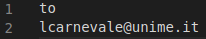
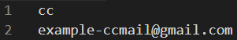
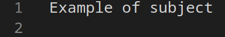
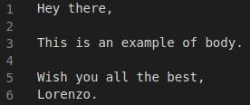

# Publicity bot mst

A causa dell'aumento della complessità di gestione di specifici problemi, workshop e conferenze, dei tool automatici ci vengono in soccorso. Questo progetto mira a inviare mail, con una specifica routine, tramite Gmail con un semplice programma a riga di comando.

# Code
Questa applicazione è nata a partire da ciò che è stato pubblicato dal Professore Carnevale all'interno del suo personale repository: <a href="https://github.com/lcarnevale/publicity-bot">lcarnevale/publicity-bot</a>.
Basandomi su quanto è stato condiviso ho adattato il tutto per essere distribuibile tramite container.

Rispetto all'originale main.py ho apportato le seguenti modifiche:
- importo la libreria environ così da poter ottenere la password tramite variabile d'ambiente e non da CLI

- è stata modificata la funzione ```read_email_cc``` così da poter ottenere la lista dei destinatari in copia
``` python
def read_email_cc(email_cc_file):
    email_cc = []
    if email_cc_file:
        email_cc += ','.join(pd.read_csv(email_cc_file)['cc']).split(',')
    return email_cc
```

Invece rispetto all'originale emailapi.py ho apportato le seguenti modifiche:
- generiche modifiche alle stampe di log

- Nella funzione ```__setup_logging``` ho impostato il log nel file /log/mailcli.log
``` python
def __setup_logging(self, verbosity=False):
        format = "%(asctime)s %(filename)s:%(lineno)d %(levelname)s - %(message)s"
        filename='/log/mailcli.log'
        datefmt = "%d/%m/%Y %H:%M:%S %Z"
        level = logging.INFO
        if (verbosity):
            level = logging.DEBUG
        logging.basicConfig(filename=filename, filemode='a', format=format, level=level, datefmt=datefmt)
```

- Nella funzione ```send_all``` il messaggio viene creato una sola volta e inviato a tutti i destinatari, sia to che cc.
``` python
def send_all(self):
        logging.info('------------ SENDING %s ------------' % (self.__emails_subject))
        context = ssl.create_default_context()
        with SMTP_SSL(self.__host, self.__port, context=context) as client:
            client.login(self.__email_from, self.__password)
            message = self.__create_message(self.__email_from, self.__emails_to, self.__emails_cc)
            total_to=[self.__emails_to]+self.__emails_cc.split(',')
            logging.info('sending email to %s' % (", ".join(total_to)))
            for to in [x for x in total_to if x]:
                self.__send_message(client, self.__email_from, to, message)
```

# How to build it
Il progetto si basa sull'utilizzo del servizio SMTP di Gmail per inviare mail, tramite la porta 465. Per permetterne l'utilizzo da CLI è necessario abilitare l'autentificazione a 2 fattori e generare una Password per le App per effettuare il login, in quanto dal 30 maggio 2022 Google non supporterà più l'uso di app di terze parti o dispositivi che chiedono di accedere all'Account Google utilizzando solo il nome utente e la password.

L'applicazione richiede la lista dei destinatari, il corpo e l'oggetto della mail. La lista dei destinatari in copia è, invece, opzionale.
Questi requisiti deve essere salvato su file indipendenti (denominati rispettivamente: mailto.csv, cc.csv, subject.csv, body.csv) all'interno di una directory dedicata. I file devono avere la seguente costruzione:

<p align="center">
  
  <br>
  <em>Esempio di mail to</em>
  <br> <br>
  
  <br>
  <em>Esempio di mail cc</em>
  <br> <br>
  
  <br>
  <em>Esempio dell'oggetto della mail</em>
  <br> <br>
  
  <br>
  <em>Esempio del corpo della mail</em>
</p>

### Cron
Per mandare mail seguendo una routine utilizziamo il demone di pianificazione dei lavori basato sul tempo, <b>Cron</b>. Cron viene eseguito in background e le operazioni pianificate, denominate "cron job", vengono eseguite automaticamente.
I Cron job vengono registrati e gestiti tramite dei file presenti nella directory /etc/cron.d/ .
La sintassi per le espressioni cron può essere suddivisa in due elementi: la pianificazione e il comando da eseguire.

La componente di pianificazione della sintassi è suddivisa in 5 diversi campi, che vengono scritti nel seguente ordine:

|     Field        | Allowed Values  |
|:----------------:|:---------------:|
| Minute           | 0-59            |
| Hour             | 0-23            |
| Day of the month | 1-31            |
| Month            | 1-12 or JAN-DEC |
| Day of the week  | 0-6 or SUN-SAT  |

Nelle espressioni cron, un asterisco è una variabile che rappresenta tutti i valori possibili. Pertanto, un'attività pianificata con * * * * * oppure */1 * * * * ... verrà eseguita ogni minuto di ogni ora di ogni giorno di ogni mese.


Il Cronjob pianificato per questo progetto è il seguente:
```bash
MAILPASS=ENVPASS
MAIL=ENVMAIL
PORT=ENVPORT
HOST=ENVHOST

ENVMIN ENVHOUR ENVMDAY ENVMONTH ENVWDAY root /bin/bash -c /publicity-bot/publicity-bot/start_bot.sh
```
Il cron necessita le specifiche variabili d'ambiente all'interno del cronjob stesso. In questa prova ho pianificato il job per eseguire ogni minuto il bot, configurando la pianificazione tramite variabili d'ambinete che vengono configurante dentro il docker-compose.yml e sostituite grazie all'entrypoint.sh.

### Script
Per rendere il tutto più automatico possibile sono stati pensati due script sh:
- il primo, chiamato ```start_bot.sh```, esegue il bot con i seguenti parametri
```bash
python3 /publicity-bot/publicity-bot/main.py \
    --host $HOST \
    --port $PORT \
    --from $MAIL \
    --to /publicity-bot/publicity-bot/files/mailto.csv \
    --cc /publicity-bot/publicity-bot/files/cc.csv \
    --subject /publicity-bot/publicity-bot/files/subject.csv \
    --body /publicity-bot/publicity-bot/files/body.csv
```

- il secondo, chiamato ```entrypoint.sh```, sarà il primo comando eseguito dal container. In ordine:
<ol>
	<li>avvio del demone di cron</li>
	<li>col comando sed sostisuisco al cronjob i valori delle variabili d'ambiente</li>
	<li>copio il cronjob nella cartella di default di cron</li>
	<li>l'if è pensato per controllare se esiste il file di log; se non esiste viene creato</li>
	<li>col comando tail +1f aggiorno la stampa del log in tempo reale</li>
</ol>

```bash
service cron start

sed -i s/ENVMAIL/$MAIL/ scripts/cronjob
sed -i s/ENVPASS/$MAILPASS/ scripts/cronjob
sed -i s/ENVHOST/$HOST/ scripts/cronjob
sed -i s/ENVPORT/$PORT/ scripts/cronjob
sed -i s/ENVMIN/$MIN/ scripts/cronjob
sed -i s/ENVHOUR/$HOUR/ scripts/cronjob
sed -i s/ENVMDAY/$MDAY/ scripts/cronjob
sed -i s/ENVMONTH/$MONTH/ scripts/cronjob
sed -i s/ENVWDAY/$WDAY/ scripts/cronjob

cp scripts/cronjob /etc/cron.d/

if [ ! -f "/log/mailcli.log" ]; then
        touch /log/mailcli.log
fi

tail +1f /log/mailcli.log
```

### Docker
Docker è una piattaforma software che permette di creare, testare e distribuire applicazioni con la massima rapidità. Docker raccoglie il software in unità standardizzate chiamate container che offrono tutto il necessario per la loro corretta esecuzione, incluse librerie, strumenti di sistema, codice e runtime. Con Docker, è possibile distribuire e ricalibrare le risorse per un'applicazione in qualsiasi ambiente, tenendo sempre sotto controllo il codice eseguito.

L’esecuzione di Docker offre agli sviluppatori un modo altamente affidabile e poco costoso per creare, spedire ed eseguire applicazioni distribuite su qualsiasi scala.

Docker fornisce una modalità standard per eseguire il tuo codice. Si tratta di un sistema operativo per container. Così come la macchina virtuale virtualizza i server hardware (ovvero elimina la necessità di gestirli direttamente), i container virtualizzano il sistema operativo di un server. Docker è installato su ogni server e fornisce semplici comandi con cui creare, avviare o interrompere i container.

#### Dockerfile
Docker può creare immagini leggendo le istruzioni da un Dockerfile. Un Dockerfile è un documento di testo che contiene le istruzioni che Docker deve eseguire per impostare il container. Un'immagine Docker è un modello in sola lettura che definisce il container. L'immagine contiene il codice che verrà eseguito, incluse le definizioni per librerie e dipendenze necessarie. Un container Docker è un'immagine Docker in esecuzione.
Di seguito il link all'immagine nel Docker Hub:
<a href="https://hub.docker.com/r/mastronardo/publicity-bot-mst">mastronardo/publicity-bot-mst</a>

#### Docker Compose
Il file Compose è un file YAML che definisce servizi, reti e volumi per un'applicazione Docker. Docker Compose è uno strumento sviluppato per aiutare a definire e condividere applicazioni multi-container. Il grande vantaggio dell'utilizzo di Compose è che puoi definire lo stack dell'applicazione e settare l'ambiente d'esecuzione in un solo file.

``` bash
version: "3.9"
services:
  publicity-bot-mst:
    # immagine presa dal Docker Hub
    image: mastronardo/publicity-bot-mst
    container_name: ${COMPOSE_PROJECT_NAME}-publicity-bot-mst
    # passo al container i file .csv tramite binding
    # creo un volume per rendere persistente il file di log
    volumes:
      - ./${NAMEDIR}/:/publicity-bot/publicity-bot/files/
      - <VOLUME>:/log/
    # passo le variabili d'ambiente tramite il file .env
    environment:
      MAIL: ${MAIL}
      MAILPASS: ${MAILPASS}
      PORT: ${PORT}
      HOST: ${HOST}
      MIN: ${MIN}
      HOUR: ${HOUR}
      MDAY: ${MDAY}
      MONTH: ${MONTH}
      WDAY: ${WDAY}
volumes:
  <VOLUME>:
```

La struttura del file .env è la seguente:
Ho utilizzato la variabile d'ambiente ```COMPOSE_PROJECT_NAME``` per fare in modo di assegnare a ogni progetto un nome diverso, così da poter eseguire contemporaneamente due container.
``` bash
COMPOSE_PROJECT_NAME=<examplename>
NAMEDIR=files
MAIL=<youremail@gmail.com>
MAILPASS=<password>
PORT=465
HOST=smtp.gmail.com
MIN=\*\/1
HOUR=\*
MDAY=\*
MONTH=\*
WDAY=\*
```

Per rendere il più flessibile possibile il bot ho gestito il nome del progetto, la directory dei requisiti, l'indirizzo mail, la sua password, il servizio per l'inoltro di mail e la pianificazione di cron, gestendole come variabili d'ambiente per adattarsi facilmente alle necessità di un nuovo utente che vuole utilizzare il bot.


# How to use it
Una volta creata la cartella con i file necessari e modificato il docker compose e il file .env in base alle proprie preferenze, basterà eseguire il comando riportato sotto per far partire il bot:

```bash
sudo docker compose --env-file <FILE.env> up
```
